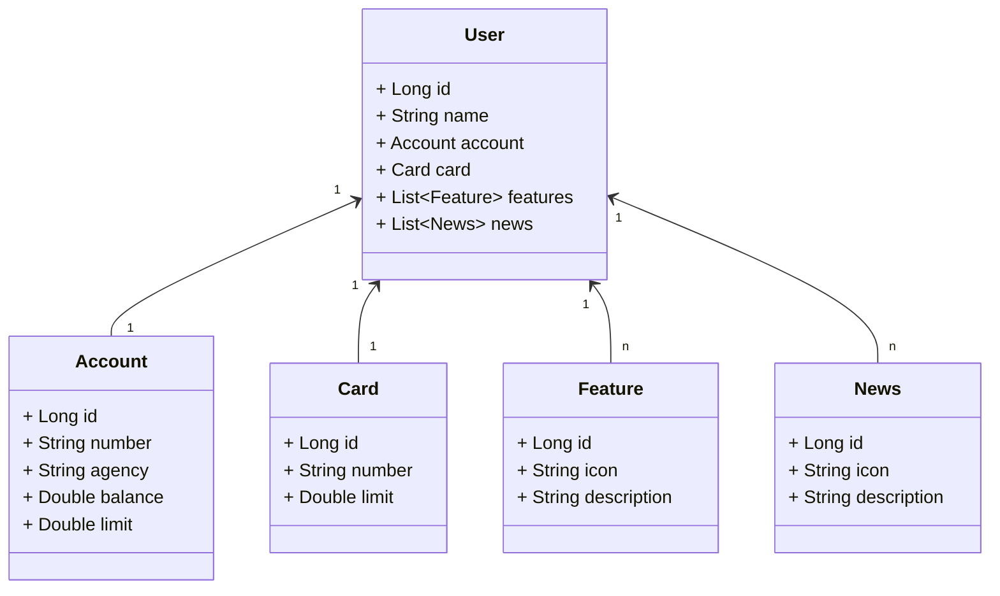

<h1 align="center"> DESENVOLVIMENTO JAVA COM IA - GFT </h1>

 <a href="https://web.dio.me/" target="_blank">DIO</a> 

<a href="#sobre">Sobre</a>&nbsp;&nbsp;&nbsp|&nbsp;&nbsp;&nbsp;
<a href="#tecnologia">Tecnologia</a>&nbsp;&nbsp;&nbsp|&nbsp;&nbsp;&nbsp;
<a href="#autor">Autor</a>.

# Sobre

 
<h1>API Projeto</h1>

Esta API foi desenvolvida com o objetivo de fornecer funcionalidades para gerenciamento de usuários, contas, recursos, cartões e notícias.
API reproduzida pela desafio de projetos da DIO é API REST na nuvem usando spring boot 3 e a nuvem Railway. 

# Diagrama de Classe 

# API Swagger e Railway
 

 

   
      
 

 

    01 - Figura mostra no swagger sendo adicionado um usuário com deploy.
 

 
 

  

  

   
      
 

 

    02 - Figura mostra interface do Railway mostrando tabela do usuario com banco de dados Postgrel.
 

 
 

  

# Tecnologia

Esse projeto foi desenvolvindo com as seguintes tecnologias:

- **Java 17**: Linguagem de programação utilizada para desenvolver a API.
- **Spring Boot 3**: Framework que simplifica a criação de aplicações Java, permitindo configurar e iniciar a aplicação com o mínimo de esforço.
- **Spring Data JPA**: Abstração de persistência que facilita a implementação de repositórios baseados em JPA (Java Persistence API).
- **Swagger**: Ferramenta para documentação de APIs RESTful, permitindo testar as endpoints diretamente pela interface do Swagger UI.
- **Railway**: Plataforma de nuvem utilizada para deploy e hospedagem da aplicação.
  
 

  # Dificuldades API REST

  Encontrei dificuldades na aplicação em ambiente de produção. Após assistir ao vídeo do professor várias vezes, percebi que o problema
  estava relacionado à plataforma Railway. Ela não oferecia suporte para o Gradle 8.8, o que causava os erros na aplicação. 
  Resolvido problema API funcionou lindamente!

# Autor

_Daniela Velter_
 
 

